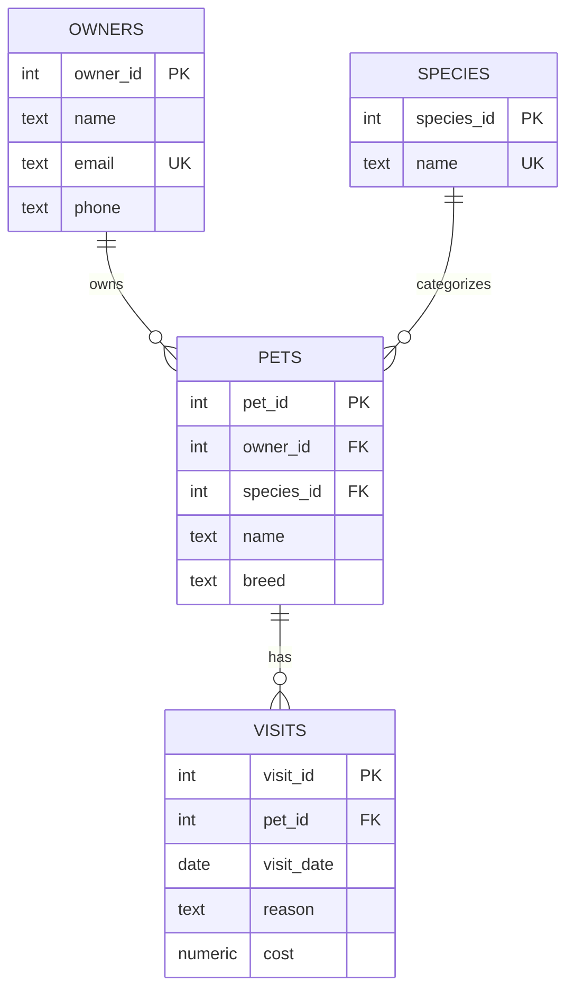

# Paws & Claws ERD

## Entity-Relationship Diagram (Mermaid Format)

Render this diagram at https://mermaid.live or in any Markdown viewer that supports Mermaid.



## Text-Based ERD

```
┌─────────────────────────────────────────────────────────────────────────────┐
│                     PAWS & CLAWS VETERINARY CLINIC ERD                       │
└─────────────────────────────────────────────────────────────────────────────┘

┌──────────────────────┐              ┌──────────────────────┐
│       OWNERS         │              │       SPECIES        │
├──────────────────────┤              ├──────────────────────┤
│ owner_id     SERIAL  │──────┐      │ species_id   SERIAL  │──────┐
│              PK      │      │      │              PK      │      │
│ name         TEXT    │      │      │ name         TEXT    │      │
│              NOT NULL│      │      │              NOT NULL│      │
│ email        TEXT    │      │      │              UNIQUE  │      │
│              NOT NULL│      │      └──────────────────────┘      │
│              UNIQUE  │      │                                    │
│ phone        TEXT    │      │                                    │
│              NULL OK │      │                                    │
└──────────────────────┘      │                                    │
                              │                                    │
                              │ 1:N                           1:N  │
                              │                                    │
                              ▼                                    ▼
┌──────────────────────────────────────────────────────────────────────────────┐
│                                   PETS                                        │
├──────────────────────────────────────────────────────────────────────────────┤
│ pet_id        SERIAL      PRIMARY KEY                                         │
│ owner_id      INTEGER     NOT NULL  REFERENCES owners(owner_id)    FK ◄───────│
│ species_id    INTEGER     NOT NULL  REFERENCES species(species_id) FK ◄───────│
│ name          TEXT        NOT NULL                                            │
│ breed         TEXT        NOT NULL                                            │
│                                                                               │
│ UNIQUE (owner_id, name, species_id)  -- Same owner can't have duplicate pets │
│ ON DELETE CASCADE (owner)   -- Delete pets when owner is deleted              │
│ ON DELETE RESTRICT (species) -- Can't delete species with existing pets       │
└────────────────────────────────────────┬─────────────────────────────────────┘
                                         │
                                         │ 1:N
                                         │
                                         ▼
┌──────────────────────────────────────────────────────────────────────────────┐
│                                  VISITS                                       │
├──────────────────────────────────────────────────────────────────────────────┤
│ visit_id      SERIAL      PRIMARY KEY                                         │
│ pet_id        INTEGER     NOT NULL  REFERENCES pets(pet_id)        FK ◄───────│
│ visit_date    DATE        NOT NULL                                            │
│ reason        TEXT        NOT NULL                                            │
│ cost          NUMERIC(8,2) NOT NULL  CHECK (cost >= 0)                        │
│                                                                               │
│ UNIQUE (pet_id, visit_date, reason, cost)  -- Prevent exact duplicate visits │
│ ON DELETE CASCADE (pet)  -- Delete visits when pet is deleted                 │
└──────────────────────────────────────────────────────────────────────────────┘


                            CARDINALITY SUMMARY
┌───────────────────────────────────────────────────────────────────────────────┐
│  OWNERS  ──┤├──<  PETS    One owner has many pets; each pet has one owner    │
│  SPECIES ──┤├──<  PETS    One species has many pets; each pet has one species│
│  PETS    ──┤├──<  VISITS  One pet has many visits; each visit is for one pet │
└───────────────────────────────────────────────────────────────────────────────┘

                              LEGEND
┌───────────────────────────────────────────────────────────────────────────────┐
│  PK  = Primary Key                                                            │
│  FK  = Foreign Key                                                            │
│  UK  = Unique Key                                                             │
│  ──┤├──<  = One-to-Many relationship                                          │
│  ─────────  = Foreign Key reference                                           │
└───────────────────────────────────────────────────────────────────────────────┘
```

## Data Flow

```
┌─────────────┐    ┌─────────────┐    ┌─────────────┐    ┌─────────────┐
│  Raw CSV    │───▶│  Staging    │───▶│   Clean     │───▶│ Normalized  │
│   (71 rows) │    │   Table     │    │   Data      │    │   Tables    │
└─────────────┘    └─────────────┘    └─────────────┘    └─────────────┘
                         │                  │                  │
                         ▼                  ▼                  ▼
                    - Import raw       - Fix casing       - 14 owners
                    - No constraints   - Recover phones   - 5 species
                    - TEXT columns     - Remove dupes     - 28 pets
                                       - 69 rows remain   - 69 visits
```
