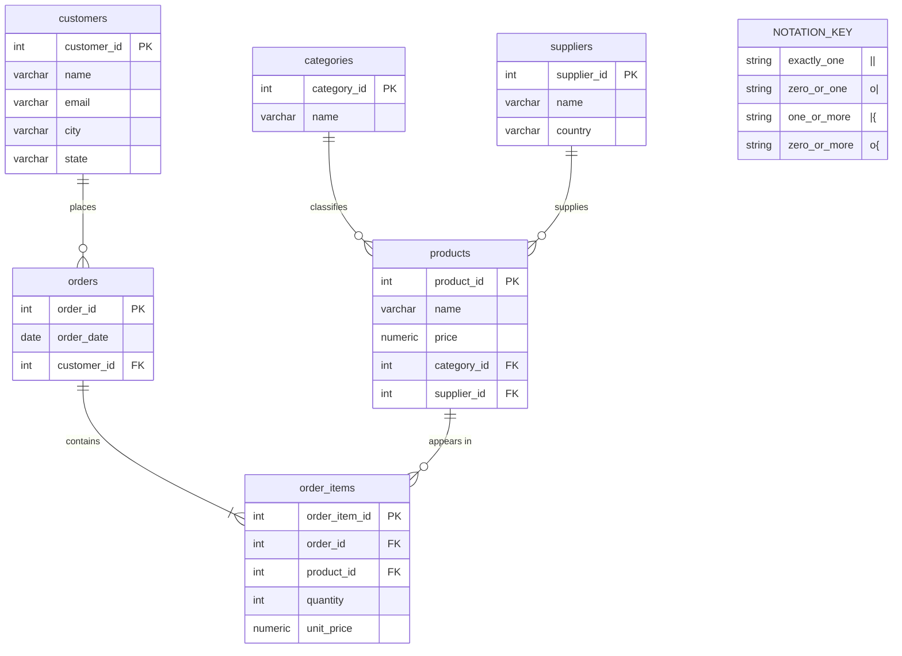

# Midterm Project

## 1. Data Inspection and Planning

Now, let me be clear about what we're looking at here. We've got a file called
`orders_raw.csv`. It's a spreadsheet — 23 rows, 12 columns — showing order
data from a small online store. Every row is one item somebody bought.

The columns tell us: which order it was, when it happened, who the customer is,
what they bought, how much it cost, how many they got, and who supplied the
product. All in one big flat table.

And here's the thing — there's a lot of copy-and-paste going on. Alice
Johnson's name, email, and address show up four separate times. The supplier
"TechSupply Co." appears six times. Every time someone orders a Wireless Mouse,
we're writing down the same product name, same category, same price all over
again. That's wasteful, and more importantly, it's risky.

Let me explain why. There are three problems that come with this kind of
structure, and folks in the database world call them anomalies:

**The update problem.** Let's say Alice changes her email. We'd have to go find
every single row with her name and update it. If we miss even one, now we've got
two different emails for the same person. That's not a minor headache — that's
bad data.

**The insert problem.** Say we sign a new supplier, but nobody's placed an order
with them yet. We can't even add them to this table, because every row requires
an order ID, a customer, a quantity. The table mixes up "what exists" with "what
was purchased," and that makes it impossible to record one without the other.

**The delete problem.** If we remove order 1007 — that's Bob's keyboard
order — we might accidentally erase our record that KeyBoard Masters is a
supplier we work with. Deleting an order shouldn't wipe out a supplier's
existence, but in a flat table, it can.

The root cause is straightforward. We crammed four or five different ideas —
customers, products, suppliers, orders — into one table. The fix is to give
each idea its own table. That's what normalization does.

---

## 2. Normalization and ERD

So let's talk about how we organize this data properly. The standard we're
aiming for is called Third Normal Form, or 3NF. Think of it as a set of rules
that make sure every piece of information lives in exactly one place.

**First Normal Form (1NF).** Each cell in the table holds one value — not a
list, not a group of things. Our CSV already passes this test. One value per
cell, every row is different. We're good.

**Second Normal Form (2NF).** Every piece of information has to depend on the
*whole* key that identifies a row, not just part of it. In our flat table, a
row is identified by a combination of order ID and product name. But the
customer's name and email? Those only depend on the order, not the product.
They don't care what product was bought. That's a partial dependency, and we
fix it by pulling customer info into its own table.

**Third Normal Form (3NF).** No column should depend on the key *through*
another column. In our flat table, the product category depends on the product
name, which depends on the row's key. That's a chain — an indirect dependency.
Same thing with the supplier's country depending on the supplier's name. We fix
this by giving categories and suppliers their own tables.

After that process, we end up with six clean tables:

1. **customers** — who our buyers are (ID, name, email, city, state)
2. **suppliers** — who we source products from (ID, name, country)
3. **categories** — the types of products we sell (ID, name)
4. **products** — what we sell (ID, name, price, which category, which supplier)
5. **orders** — each purchase event (ID, date, which customer)
6. **order_items** — the individual lines on each order (ID, which order, which product, how many, price at time of sale)

Here's the Entity-Relationship Diagram that shows how these tables connect:



Now, those lines between the boxes — the ones with the little symbols on the
ends — that's called crow's foot notation. Each end of a line tells you two
things: is the relationship **mandatory or optional**, and is it **one or many**?

Here's the key. Each symbol is made of two parts — an **inner** mark (closest
to the line) that tells you the minimum, and an **outer** mark (closest to the
entity box) that tells you the maximum:

| Symbol | Inner mark | Outer mark | Minimum | Maximum | Plain English |
|--------|-----------|------------|---------|---------|---------------|
| `\|\|` | `\|` (one) | `\|` (one) | 1 | 1 | **Exactly one.** Required, and only one. |
| `o\|` | `o` (zero) | `\|` (one) | 0 | 1 | **Zero or one.** Optional, but at most one. |
| `\|{` | `\|` (one) | `{` (many) | 1 | Many | **One or more.** Required, and can be many. |
| `o{` | `o` (zero) | `{` (many) | 0 | Many | **Zero or more.** Optional, and can be many. |

The three building blocks are:
- `|` — a single vertical bar means **one** (and exactly one)
- `o` — a circle means **zero** (it's optional)
- `{` — a crow's foot (the fork shape) means **many**

To read a relationship line, look at **each end separately**. The symbol at
each end describes that side. For example:

`customers ||--o{ orders`

- The left end (`||`) is on the customers side — **exactly one** customer.
- The right end (`o{`) is on the orders side — **zero or more** orders.
- Read together: "Each order belongs to exactly one customer. Each customer
  has zero or more orders."

`orders ||--|{ order_items`

- The left end (`||`) is on the orders side — **exactly one** order.
- The right end (`|{`) is on the order_items side — **one or more** items.
- Read together: "Each order item belongs to exactly one order. Each order
  has one or more items." That `|{` instead of `o{` matters — an order with
  zero items isn't really an order, so the minimum is one, not zero.

Let me walk through all five relationships:

- A **customer** can place many orders, but each order belongs to exactly one
  customer.
- An **order** contains one or more line items. Each line item belongs to
  exactly one order.
- A **product** can appear on many different orders. Each line item refers to
  exactly one product.
- A **category** groups many products together, but each product sits in
  exactly one category.
- A **supplier** provides many products, but each product comes from exactly
  one supplier.

One thing worth noting: the order_items table has its own `unit_price` column,
separate from the product's current price. That's intentional. If we raise the
price of a Wireless Mouse next month, we don't want last month's orders to
suddenly show the new price. The order item captures what the customer actually
paid.

This schema actually meets an even stricter standard called BCNF — Boyce-Codd
Normal Form. In plain terms, that means every dependency in every table points
back to that table's primary key. There are no shortcuts, no back doors. It's
as clean as it gets.

---

## 3. Table Design and Constraints

Now let's look at the actual SQL that creates these tables. This lives in a
migration file that gets run automatically when we start the program.

```sql
CREATE TABLE customers (
    customer_id SERIAL PRIMARY KEY,
    name        VARCHAR(100) NOT NULL,
    email       VARCHAR(150) NOT NULL UNIQUE,
    city        VARCHAR(100) NOT NULL,
    state       CHAR(2)      NOT NULL
);
```

Let me break this down. `SERIAL PRIMARY KEY` means the database generates a
unique number for each customer automatically — 1, 2, 3, and so on. We never
have to pick one ourselves. `VARCHAR(100)` means "text up to 100 characters
long." `CHAR(2)` for state means exactly two characters — like OR, WA, CA.
`NOT NULL` means the field can't be left blank. And `UNIQUE` on email means no
two customers can share the same email address.

```sql
CREATE TABLE suppliers (
    supplier_id SERIAL PRIMARY KEY,
    name        VARCHAR(100) NOT NULL UNIQUE,
    country     VARCHAR(60)  NOT NULL
);
```

Same pattern here. Each supplier gets an auto-generated ID. The name is marked
`UNIQUE` so we don't accidentally create the same supplier twice.

```sql
CREATE TABLE categories (
    category_id SERIAL PRIMARY KEY,
    name        VARCHAR(60) NOT NULL UNIQUE
);
```

A simple lookup table. Electronics, Furniture, Office Supplies — each one
appears once and only once.

```sql
CREATE TABLE products (
    product_id  SERIAL PRIMARY KEY,
    name        VARCHAR(100) NOT NULL UNIQUE,
    price       NUMERIC(10,2) NOT NULL CHECK (price > 0),
    category_id INT NOT NULL REFERENCES categories(category_id),
    supplier_id INT NOT NULL REFERENCES suppliers(supplier_id)
);
```

A couple new things here. `NUMERIC(10,2)` stores dollar amounts precisely — no
rounding errors that you'd get with regular decimal numbers. `CHECK (price > 0)`
tells the database to reject any product with a zero or negative price.
`REFERENCES` creates a foreign key — a link to another table. The database
won't let you assign a product to a category that doesn't exist. It keeps
everything honest.

```sql
CREATE TABLE orders (
    order_id    INT PRIMARY KEY,
    order_date  DATE NOT NULL,
    customer_id INT  NOT NULL REFERENCES customers(customer_id)
);
```

Notice `order_id` is just `INT`, not `SERIAL`. That's because we're keeping the
original order numbers from the CSV — 1001 through 1010. The foreign key to
customers makes sure every order is tied to a real person.

```sql
CREATE TABLE order_items (
    order_item_id SERIAL PRIMARY KEY,
    order_id      INT           NOT NULL REFERENCES orders(order_id),
    product_id    INT           NOT NULL REFERENCES products(product_id),
    quantity      INT           NOT NULL CHECK (quantity > 0),
    unit_price    NUMERIC(10,2) NOT NULL CHECK (unit_price > 0),
    UNIQUE (order_id, product_id)
);
```

This is the table that ties everything together. It connects orders to products.
The `UNIQUE` constraint on the combination of order_id and product_id means you
can't list the same product twice on the same order. Both quantity and
unit_price have `CHECK` constraints — no zeros, no negatives.

The migration file also has a "down" section that removes all the tables in the
right order if we ever need to start over.

---

## 4. Data Ingestion Process

So we've got a clean schema. Now we need to actually move the data from that
CSV file into our six tables. We wrote a Go program to do this, and the
strategy is straightforward: migrate, parse, and load.

**Step one: migrate.** When the program starts, it runs the migration file
automatically. That creates all six tables if they don't already exist. You
don't need to set up the database by hand — the program handles it.

**Step two: parse the CSV.** The program opens `orders_raw.csv`, skips the
header row, and reads each line into a structured format. It converts prices
to numbers, quantities to whole numbers. If anything looks wrong — a price
that isn't a number, a quantity that doesn't make sense — the program stops
and tells you exactly what the problem is. We'd rather catch bad data early
than put garbage in the database.

**Step three: load the data.** This is where the flat CSV gets separated into
the six normalized tables. The program wraps everything in a single
transaction — think of it as an all-or-nothing operation. Either every row
gets inserted correctly, or nothing does. No half-finished state.

For each row in the CSV, the program inserts things in the right order:

1. Suppliers first — they don't depend on anything else
2. Categories — also independent
3. Products — these need a category and supplier to already exist
4. Customers — independent
5. Orders — these need a customer to already exist
6. Order items — these need both an order and a product

To handle the duplicates in the CSV — remember, Alice Johnson appears four
times — the program keeps a lookup table in memory. The first time it sees
Alice's email, it inserts her and remembers her ID. The second time, it skips
the insert and reuses the ID it already has. Same approach for suppliers,
categories, and products.

No special data cleaning was needed here. The CSV was well-formed — consistent
formatting, no missing values, no encoding issues. In a real-world scenario,
you'd want to trim whitespace, validate emails, and handle missing data. But
this dataset was clean.

The program prints two lines when it's done: "read 23 rows from CSV" and
"ingestion complete."

---

## 5. Sample Queries and Results

Now here's where we see the payoff. We've got a second Go program that runs
three queries against our normalized database.

**Query 1: Reconstruct the original dataset.** This is the proof that our
normalization didn't lose anything. We join all six tables back together —
order_items connects to orders for the date and customer, connects to products
for the product info, which connects to categories and suppliers. All 23 rows
come back, matching the original CSV exactly. We took the data apart and put
it back together, and nothing was lost.

**Query 2: Total revenue per customer.** This groups all the line items by
customer and adds up what each person spent (unit price times quantity). David
Park leads at $617.37 across 2 orders — that standing desk at $399.99 does
the heavy lifting. Bob Martinez is close behind at $589.95. Grace Kim spent
the least at $149.94 from a single order. This kind of question is exactly what
normalization makes easy. Since each customer lives in one place, there's no
risk of counting someone twice because their info was repeated across rows.

**Query 3: Oregon customers and their purchases.** This filters down to
customers where the state is OR. Three people come back: Alice Johnson and
David Park in Portland, and Fatima Al-Rashid in Eugene. Between them, 13 line
items across 5 orders. You can see the product mix — David's order 1010 has a
standing desk, two desk lamps, and a wireless mouse. This is the kind of
geographic breakdown you'd use for regional sales reports. With normalized
data, it's straightforward — filter on one column in the customers table and
the joins bring in everything else.
