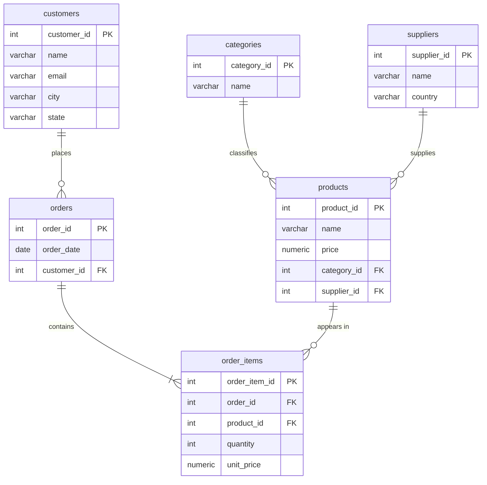

# Midterm Project

## 1. Data Inspection and Planning (2–3 min)

Let's start by opening the raw CSV file. This is `orders_raw.csv` — 23 rows and
12 columns of order data from a small e-commerce business.

Each row represents one line item on an order. The columns are: order_id,
order_date, customer_name, customer_email, customer_city, customer_state,
product_name, product_category, product_price, quantity, supplier_name, and
supplier_country.

Right away you can see the redundancy. Alice Johnson's name, email, city, and
state appear on four separate rows — once for every item she's ever ordered.
The supplier "TechSupply Co., USA" shows up six times because three different
orders include products from that supplier. "Wireless Mouse, Electronics, 29.99"
is repeated four times. Order 1002 has Bob Martinez's full info copied across
three rows just because he bought three items in one order.

This flat structure creates three classic anomalies:

**Update anomaly.** If Alice Johnson changes her email, we have to find and
update every row she appears in. Miss one and the data is inconsistent — we'd
have two different emails for the same person.

**Insert anomaly.** Say we get a new supplier or a new product. We can't add it
to this table without fabricating a fake order, because every row requires an
order_id, a customer, and a quantity. The table conflates what a product *is*
with what was *ordered*.

**Delete anomaly.** If we delete order 1007 — Bob's solo keyboard order — we
might lose the fact that KeyBoard Masters is a supplier we work with, depending
on the dataset. In general, deleting the last order that references a supplier
or product would erase that entity from our data entirely.

The root cause of all three anomalies is the same: we've jammed multiple
independent concepts — customers, products, suppliers, orders — into a single
flat table. Normalization fixes this by giving each concept its own table.

---

## 2. Normalization and ERD (3–4 min)

Let's walk through normalizing this data to Third Normal Form.

**First Normal Form.** 1NF requires atomic values in every cell and no repeating
groups. Our CSV already satisfies this — each cell holds one value and each row
is distinct.

**Second Normal Form.** 2NF eliminates partial dependencies — every non-key
attribute must depend on the *entire* primary key, not just part of it. In the
flat table, the implicit key for a row is something like (order_id,
product_name). But customer_name and customer_email don't depend on
product_name at all — they only depend on order_id. That's a partial
dependency. To fix it, we pull customer info and order info into their own
tables.

**Third Normal Form.** 3NF removes transitive dependencies — no non-key column
should depend on the primary key *through* another non-key column. In the flat
table, product_category depends on product_name, which depends on the row's
key. That's transitive. Similarly, supplier_country depends on supplier_name.
We fix these by extracting categories and suppliers into their own tables.

After normalization, we end up with six entities:

1. **customers** — customer_id, name, email, city, state
2. **suppliers** — supplier_id, name, country
3. **categories** — category_id, name
4. **products** — product_id, name, price, category_id, supplier_id
5. **orders** — order_id, order_date, customer_id
6. **order_items** — order_item_id, order_id, product_id, quantity, unit_price

Here is the Entity-Relationship Diagram:



Walking through the relationships:

- A **customer places many orders**, but each order belongs to one customer.
  One-to-many.
- An **order contains one or more order items**. Each order item belongs to
  exactly one order. One-to-many.
- A **product appears in many order items** across different orders. Each order
  item references one product. One-to-many.
- A **category classifies many products**, but each product belongs to one
  category. One-to-many.
- A **supplier supplies many products**, but each product comes from one
  supplier. One-to-many.

One design choice worth calling out: order_items has its own `unit_price` column
separate from the product's current `price`. This captures the price at the time
of sale. If a product's price changes later, historical orders stay accurate.

This schema is actually BCNF — Boyce-Codd Normal Form — which is strictly
stronger than 3NF. In every table, every functional dependency has a superkey
on the left side. No non-key column determines any other non-key column.

---

## 3. Table Design and Constraints (2–3 min)

Here are the CREATE TABLE statements from the goose migration file. Let me walk
through the data types and constraints.

```sql
CREATE TABLE customers (
    customer_id SERIAL PRIMARY KEY,
    name        VARCHAR(100) NOT NULL,
    email       VARCHAR(150) NOT NULL UNIQUE,
    city        VARCHAR(100) NOT NULL,
    state       CHAR(2)      NOT NULL
);
```

`SERIAL` auto-generates an incrementing integer for the primary key.
`VARCHAR(100)` for name and city gives reasonable room without being wasteful.
`CHAR(2)` for state since US state codes are always exactly two characters.
Email is `UNIQUE` because it's the natural key — no two customers share one.
Everything is `NOT NULL` because a customer without a name or city is
incomplete data.

```sql
CREATE TABLE suppliers (
    supplier_id SERIAL PRIMARY KEY,
    name        VARCHAR(100) NOT NULL UNIQUE,
    country     VARCHAR(60)  NOT NULL
);
```

Supplier name is `UNIQUE` — it's how we deduplicate during ingestion. Same
pattern: serial PK, everything NOT NULL.

```sql
CREATE TABLE categories (
    category_id SERIAL PRIMARY KEY,
    name        VARCHAR(60) NOT NULL UNIQUE
);
```

Simple lookup table. `UNIQUE` on name prevents duplicate categories.

```sql
CREATE TABLE products (
    product_id  SERIAL PRIMARY KEY,
    name        VARCHAR(100) NOT NULL UNIQUE,
    price       NUMERIC(10,2) NOT NULL CHECK (price > 0),
    category_id INT NOT NULL REFERENCES categories(category_id),
    supplier_id INT NOT NULL REFERENCES suppliers(supplier_id)
);
```

`NUMERIC(10,2)` stores exact decimal values for money — no floating-point
rounding issues. The `CHECK (price > 0)` constraint prevents nonsensical
zero or negative prices at the database level. The two foreign keys enforce
referential integrity — you can't assign a product to a category or supplier
that doesn't exist.

```sql
CREATE TABLE orders (
    order_id    INT PRIMARY KEY,
    order_date  DATE NOT NULL,
    customer_id INT  NOT NULL REFERENCES customers(customer_id)
);
```

Here order_id is a plain `INT` — not SERIAL — because we're preserving the
original order IDs from the CSV (1001–1010). The foreign key to customers
ensures every order is tied to a real customer.

```sql
CREATE TABLE order_items (
    order_item_id SERIAL PRIMARY KEY,
    order_id      INT           NOT NULL REFERENCES orders(order_id),
    product_id    INT           NOT NULL REFERENCES products(product_id),
    quantity      INT           NOT NULL CHECK (quantity > 0),
    unit_price    NUMERIC(10,2) NOT NULL CHECK (unit_price > 0),
    UNIQUE (order_id, product_id)
);
```

This is the junction table that ties orders to products. The `UNIQUE`
constraint on (order_id, product_id) prevents duplicate line items — you
can't have the same product listed twice on the same order. Both `quantity`
and `unit_price` have `CHECK` constraints ensuring positive values.

The migration also includes a `goose Down` section that drops all tables in
reverse dependency order, so we can cleanly roll back if needed.

---

## 4. Data Ingestion Process (2–3 min)

For ingestion I wrote a Go program using the standard library's `encoding/csv`
package and `database/sql` with the `lib/pq` PostgreSQL driver.

The strategy has three steps: migrate, parse, and load.

**Step one: migrate.** The program runs goose migrations on startup. This
creates all six tables with their constraints if they don't already exist. This
means the ingest program is self-contained — you don't need to run a separate
migration step.

**Step two: parse the CSV.** The program reads `orders_raw.csv` using Go's
`csv.Reader`, skips the header row, and parses each row into a typed struct.
Prices are parsed as floats, quantities as ints. If any value is malformed the
program stops with a clear error message rather than inserting bad data.

**Step three: load into normalized tables.** This is where the denormalized
data gets split into the six tables. The program iterates through all 23 rows
inside a single database transaction. For each row it inserts entities in
dependency order:

1. Suppliers first — no foreign key dependencies
2. Categories — also no dependencies
3. Products — depends on suppliers and categories
4. Customers — no dependencies
5. Orders — depends on customers
6. Order items — depends on orders and products

To avoid duplicate inserts, the program maintains in-memory maps. For example,
a map from customer email to customer_id. When it encounters Alice Johnson's
email for the second time, it skips the customer insert and reuses the existing
ID. Same pattern for suppliers, categories, and products.

Each insert uses `RETURNING` to get back the auto-generated primary key, which
is then cached in the map for use by dependent inserts.

The entire load runs in one transaction. If anything fails — a constraint
violation, a bad foreign key — the whole thing rolls back cleanly. No partial
data.

No special data cleaning was needed for this dataset. The CSV was well-formed:
consistent formatting, no nulls, no encoding issues. In a production scenario
you'd want to add trimming of whitespace, email validation, and handling of
missing values — but this data didn't require it.

Running the program prints two lines: "read 23 rows from CSV" and "ingestion
complete."

---

## 5. Sample Queries and Results (2–3 min)

I have a second Go program that runs three queries against the normalized
database.

**Query 1: Reconstruct the original dataset.** This five-way JOIN across all
six tables reproduces the original flat CSV. Order_items joins to orders for the
date and customer, joins to products for the product info, which joins to
categories and suppliers. Ordering by order_id and order_item_id gives us the
rows in the same sequence as the original file. All 23 rows come back with
matching values. This proves the normalization was lossless — we didn't lose
any information by splitting the data apart.

**Query 2: Total revenue per customer.** This aggregation groups by customer
and sums `unit_price * quantity` for each line item. The results show David Park
leading at $617.37 across 2 orders and 13 items — that standing desk at $399.99
does the heavy lifting. Bob Martinez is close behind at $589.95. Grace Kim
spent the least at $149.94 with a single order. This kind of query is exactly
what normalization enables cleanly — you're not at risk of double-counting a
customer because their info was duplicated across rows.

**Query 3: Oregon customers and their purchases.** This filtered query pulls
all order line items for customers in Oregon — state equals 'OR'. Three
customers come back: Alice Johnson and David Park in Portland, and Fatima
Al-Rashid in Eugene. Between them they have 13 line items across 5 orders. You
can see the product mix — David Park's order 1010 includes a standing desk,
two desk lamps, and a wireless mouse. This is the kind of geographic analysis
you'd do for regional sales reporting or targeted marketing. The normalized
schema makes it straightforward: filter on one column in the customers table
and the JOINs pull in everything else.
